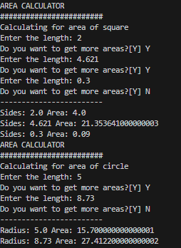

<div style="display: flex; justify-content: space-between">
    <div style="display: flex; flex-direction: column"> 
        <strong>Carlos Emilio Alcantara</strong>
        <strong>BSCS - 3<sup>rd</sup> Year</strong>
    </div>
    <div style="display: flex; flex-direction: column; text-align: right"> 
        <strong>July 1, 2024</strong>
        <strong>CS ELEC - 1</strong>
    </div>
</div>

<div style="display: flex; flex-direction: column; text-align: center;
            margin: 2em 0">
    <span>Chapter 2: Advanced Python Programming</span>
    <span>Research and Development Exercise</span>
</div>

For the completion of this research and development exercise I have created an object oriented python program that calculates for the areas of circles and squares. The area of a shape is the space occupied by the boundary of a plane figures like circles, rectangles, and triangles. I will now proceed to explain my program by going through each requirement, proving that it indeed fulfills them.

**Function**
The program contains in total eight functions. Four of these functions are essentially the same and make use of inheritance and polymorphism to make the program shorter, simpler, and more elegant.

The ```__init__ ``` functions are used to initialize each object. In the class Area it has an array which would be later used for the calculation of the areas and a variable for the current date, for formatting later. It has two print functions to give the program a prompt. These functions take in the argument ```self``` as the instance of the object itself i.e. its own self and is called everytime a new object of the class is created. On the other classes inheritance is used to inherit properties of this original ```__init__``` and these print out prompts for their respective shapes.

The ```giveNumbers``` function contain a while loop which loops as long as the ```confirmation``` variable is of the value "Y". Inside the loop is a try-except that will try to convert the string inputted by the user into a float. If the value of the string is proper it gets appended to the numbers array to be later used for calculations and if not Python shall throw a ValueError and the except block will print a warning.

The ```getArea``` function prints a formatted string of the current date. A for loop will go through the ```numbers``` array to get every number given by the user which is then used to calculate for the areas of either circles or squares.

The ```main``` function creates instancecs of objects and calls the functions assigned inside these classes. It is then ran to initiate the program.

**Lambda**
The program makes use of lambda functions for the calculation of areas. Since math equations are usually short and can fit inside single lines it made sense to use lambda to create functions that calculate for the area.

**Array**
The ```numbers``` array contains all numbers inputted by the user for the calculation of areas. 

**Objects & Classes**
The program makes use of objects and classes or the concepts of object oriented programming. Three classes are present. The ```Area```, ```Square```, and ```Circle``` classes. The ```Area``` class is the parent class consisting of properties that are to be used later in its child classes to ensure the code is cleaner, for example the ```__init__``` function is inherited in the children classes for use in creating a prompt and storing the numbers for calculation of the shapes areas, while the ```giveNumbers``` class is used to get numbers for calculation of both shapes, and the ```getArea``` function while only containing a date and printed out string for a prompt in this class, is later inherited and added upon to create the functions for doing the equations. The children classes ```Square``` and ```Circle``` contain the respective equations for their respective shapes in their ```getArea``` functions.

**Inheritance**
The program makes use of inheritance by the usage of parent and child classes as explained above in the Objects & Classes section of this document. It also uses inheritance via the usage of the ```super``` function to inherit all properties of the ```__init__``` function in the ```Area``` class and by simply calling the parent to get the properties of the ```getArea``` function.

**Module**
The program imports the datetime module to get the date the program was ran in which is then displayed for an added functionality and requirement fulfillment. To get the current date the ```now``` function is used which is stored in a variable of the same name and then formatted later using the ```strftime``` function so it would display the month, day, and year instead of the default output.

**Dates**
This requirement is fulfilled by the usage of the datetime module, used as explained in the module section of this document.

**Try Except**
A try-except is present in the ```giveNumbers``` function which is used to ensure that the user inputs a proper value that can actually be converted into a float for use in the calculation of areas.

**String Formatting**
String formatting is used to make the output of the date cleaner. %B in date format means the name of the month, %d means the number of the day in the month, while %Y represents the year. So %B-%d-%Y would print out as June-24-2003 for example. String formatting is used again in the classes ```Square``` and ```Circle``` in their ```getArea``` functions. Pieces of strings are concatenated to float values converted into strings to display the sides and radius of the squares and circles and the areas of these shapes.

**Conclusion**
The program effectively demonstrates key concepts in Python programming, including the use of functions, object-oriented programming (OOP), lambda functions, arrays, and inheritance. It consists of eight functions, with four leveraging inheritance and polymorphism for simplicity and elegance. The ```__init__``` functions initialize objects, with the ```Area``` class setting up an array for numbers and the current date. The ```giveNumbers``` function handles user input with a while loop and try-except blocks for error handling, while the ```getArea``` function calculates areas using user-provided numbers and prints the date. The main function initiates the program by creating object instances and calling their functions. Lambda functions are used for concise area calculations, and the numbers array stores user inputs. The program employs three classes ```Area```, ```Square```, and ```Circle``` with ```Square``` and ```Circle``` inheriting from ```Area``` to extend functionality. The datetime module fetches and formats the current date, adding functionality. String formatting is used to display the date and area calculation results clearly. Inheritance, through the super function, reduces redundancy and promotes code reuse, while try-except blocks in ```giveNumbers``` ensure valid user input. While it was not required the program has also made usage of polymorphism via the ```__init__``` and ```getArea``` function. The ```__init___``` function is extended in the ```Square``` and ```Circle``` classes print functions with different values are present to provide respective prompts. While the ```getArea``` function in the ```Area``` class provides a general structure that is extended by the ```Square``` and ```Circle``` classes to calculate areas specific to their shapes.

The program made use of the iterative 

**Code**
> ```python
> import datetime;
> 
> class Area:
>     def __init__(self):
>         self.numbers = []
>         self.now = datetime.datetime.now()
> 
>         print("AREA CALCULATOR")
>         print("########################")
> 
>     def giveNumbers(self):
>         while True:
>             try:
>                 number = float(input("Enter the length: "))
>                 self.numbers.append(number)
> 
>                 confirmation = input("Do you want to get more areas?[Y] ")
>                 if confirmation != "Y":
>                     break                
>             except ValueError:
>                 print("Wrong value. Please enter a proper number!")
> 
>     def getArea(self):
>         self.now.strftime("Calculated at: %B-%d-%Y ")
>         print("------------------------")
> 
> class Square(Area):
>     def __init__(self):
>         super().__init__()
>         print("Calculating for area of square")
> 
>     def getArea(self):
>         Area.getArea(self)
> 
>         for number in self.numbers:
>             area = lambda side: side ** 2
>             print("Sides: " + str(number) + " Area: " + str(area(number)))
> 
> class Circle(Area):
>     def __init__(self):
>         super().__init__()
>         print("Calculating for area of circle")
> 
>     def getArea(self):
>         Area.getArea(self)
> 
>         for number in self.numbers:
>             area = lambda radius: 3.14 * radius
>             print("Radius: " + str(number) + " Area: " + str(area(number)))
> 
> def main():
>     squareCalc = Square()
>     squareCalc.giveNumbers()
>     squareCalc.getArea()
> 
>     circleCalc = Circle()
>     circleCalc.giveNumbers()
>     circleCalc.getArea()
> 
> if __name__ == "__main__":
>     main()
> ```

**Output**

